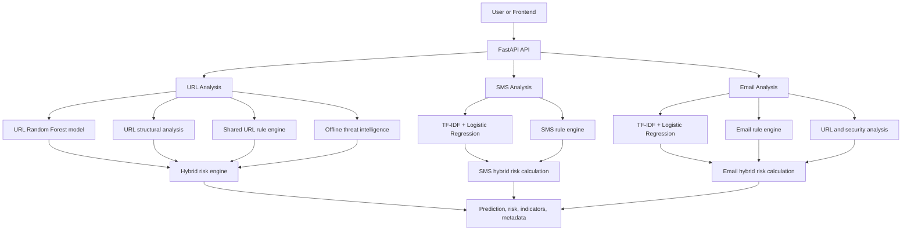

# PhishGuard AI

PhishGuard AI is an ML-powered phishing and spam analysis system for URLs, SMS messages, and emails. It combines learned classifiers with deterministic security rules and risk scoring so each result includes an explainable risk signal rather than an opaque label.

## Capabilities

- URL phishing classification with a structural Random Forest model
- SMS phishing/spam classification with TF-IDF and Logistic Regression
- Email phishing/spam classification with TF-IDF and Logistic Regression
- Hybrid ML plus rule-based risk scoring
- Offline threat-intelligence provider interface
- Rich URL structural analysis and URL security indicators
- URL analysis inside SMS and email messages
- Unified `POST /api/analyze` endpoint
- Dockerized FastAPI backend
- Automated backend unit and contract tests

The current response contract returns predictions, risk scores, risk levels, indicators, and analysis metadata where applicable. It does not currently return a `recommendations` field.

## Architecture



The specialized endpoints and unified endpoint use the same analysis functions. The URL path returns `url_analysis`; SMS and email responses return their normalized input, prediction, and risk details.

## Analysis Flow

### URL

`URL -> URL ML prediction -> URL structural analysis -> shared URL rules -> offline threat intelligence -> hybrid risk engine -> response`

### SMS

`SMS text -> TF-IDF -> Logistic Regression -> SMS rules, including embedded URL checks -> SMS hybrid risk calculation -> response`

### Email

`Subject and body -> TF-IDF -> Logistic Regression -> email rules -> embedded URL/security analysis -> email hybrid risk calculation -> response`

## Risk Engine

The URL risk engine in `backend/risk_engine.py` computes a base score as:

```text
ML score * 0.30 + rule score * 0.70
```

The ML score is the phishing probability expressed as a percentage. Rule scores are bounded by the rule analyzer. Critical rule indicators raise the combined score to at least 80. High-severity rule evidence with a rule score of at least 50 raises it to at least 70.

Risk levels are assigned from the combined score and uncertainty band:

- `LOW`: combined score below 40
- `MEDIUM`: combined score from 40 through 69
- `HIGH`: combined score of 70 or more
- `UNCERTAIN`: ML probability from 0.40 through 0.60 and rule score from 20 through 60

The URL engine protects against ML-only false positives: when there is no confirmed threat intelligence, ML probability is at least 0.90, and rule score is zero, the result is forced to `LOW` and capped at 25.

Matched threat-intelligence indicators add bounded severity adjustments: `info`/`low` 5, `medium` 10, `high` 20, and `critical` 30, capped at 30 total. Matched high or critical evidence also forces at least `HIGH`, with critical evidence forcing a score of at least 80. Duplicate indicators are removed without mutating input data.

SMS and email use their own hybrid functions. Both combine ML probability with rule evidence using a 40% ML and 60% rule weighting, then apply high-risk rule overrides. Their rule engines detect urgency, account or financial language, credentials, threats, links, suspicious embedded URLs, and high-risk combinations. Email rules additionally detect suspicious attachments and script-like HTML content.

Brand references on recognized official domains are recorded as informational indicators without adding rule points. Brand references on unrelated domains contribute impersonation evidence and can combine with sensitive actions for critical evidence.

## Threat Intelligence

Threat intelligence is currently offline and deterministic. `backend/threat_intelligence.py` defines a provider interface and a local provider that returns no match. The URL endpoint calls this provider and passes its evidence into the risk engine. The repository does not currently integrate external threat-intelligence APIs, credentials, or live lookups.

## URL Analysis

`url_analysis` is returned by the URL endpoint and contains observable metadata:

- `protocol`
- `hostname`
- `registrable_domain`
- `tld`
- `subdomain_count`
- `is_ip_address`
- `url_length`
- `domain_length`
- `path`
- `path_depth`
- `query_parameter_count`
- `query`
- `fragment`
- `port`
- `has_percent_encoding`
- `has_at_symbol`
- `is_shortened`
- `is_suspicious_tld`

This metadata describes URL structure; it is not itself a final risk verdict.

## ML Models

### URL

- Artifact: `ml/models/url_phishing_model_clean_v3.joblib`
- Type: scikit-learn `RandomForestClassifier`
- Features: 27 cleaner lexical and structural features, including URL/domain length, character composition, entropy, subdomain count, delimiter counts, and path depth
- Training split: grouped 80/20 split by domain with `random_state=42`, using `GroupShuffleSplit`
- Training configuration: 500 trees, balanced class weights, square-root feature selection

The training script computes accuracy, precision, recall, F1, and ROC-AUC, but this repository does not record a verified numeric result table. External sanity tests are separate from held-out dataset evaluation and are not a substitute for generalization evidence.

### SMS

- Artifacts: `ml/models/sms/sms_phishing_model.joblib` and `ml/models/sms/sms_tfidf_vectorizer.joblib`
- Pipeline: TF-IDF word 1-2 grams followed by Logistic Regression
- Training split: stratified 80/20 split with `random_state=42`
- Training configuration: balanced class weights, `max_iter=1000`, up to 50,000 features
- Labels: `ham` becomes legitimate (`0`); `spam` becomes phishing/spam (`1`)

The training script computes accuracy, precision, recall, and F1. Numeric results are not recorded in the repository, so no performance figure is claimed here.

### Email

- Artifacts: `ml/models/email/email_phishing_model.joblib` and `ml/models/email/email_tfidf_vectorizer.joblib`
- Pipeline: subject/body text combined, TF-IDF word 1-2 grams, then Logistic Regression
- Training split: stratified 80/20 split with `random_state=42`
- Training configuration: balanced class weights, `max_iter=1000`, up to 50,000 features
- Labels: binary legitimate versus spam/phishing labels from the training CSV

The training script computes accuracy, precision, recall, F1, and ROC-AUC. Numeric results are not recorded in the repository, so held-out performance is not represented as a claim here.

## Datasets

- URL: PhiUSIIL phishing URL dataset, downloaded through UCI repository dataset ID 967. It is used to build processed URL features and train the grouped URL classifier.
- SMS: the `SMSSpamCollection` dataset under `ml/data/raw/sms/`, using `ham` and `spam` labels.
- Email: `CEAS_08.csv` under `ml/data/raw/email/`, using `subject`, `body`, and `label` columns.

Datasets are training resources, not live threat feeds. Their source composition, labeling decisions, duplication, time period, and domain distribution limit real-world generalization. Raw datasets are not required by the backend container and are excluded from Docker context.

## API

The FastAPI application is defined in `backend/main.py`.

### `GET /health`

Returns service status and the configured model descriptions.

### `GET /`

Returns API metadata and the endpoint listing.

### `POST /api/analyze/url`

Request:

```json
{
  "url": "https://github.com"
}
```

Response includes `url`, `prediction`, `risk`, and `url_analysis`.

### `POST /api/analyze/sms`

Request:

```json
{
  "text": "Your account has been suspended. Verify now."
}
```

Response includes `text`, `prediction`, and `risk`.

### `POST /api/analyze/email`

Request:

```json
{
  "subject": "Urgent verification",
  "body": "Please verify your account immediately."
}
```

Response includes `subject`, `body`, `prediction`, and `risk`.

### `POST /api/analyze`

The unified endpoint accepts one of these `input_type` values: `url`, `sms`, or `email`.

URL request:

```json
{
  "input_type": "url",
  "url": "https://example.com"
}
```

SMS request:

```json
{
  "input_type": "sms",
  "text": "Your account has been suspended. Verify now."
}
```

Email request:

```json
{
  "input_type": "email",
  "subject": "Urgent verification",
  "body": "Please verify your account immediately."
}
```

URL values accept 3-4096 characters; SMS text accepts 1-10,000 characters; email subjects accept up to 1,000 characters and bodies up to 100,000 characters. Missing unified URL/text data and empty email content return `400`. Invalid or missing `input_type` returns FastAPI validation status `422`.

## Local Development

### Backend

From the repository root:

```powershell
python -m venv ml/.venv
.\ml\.venv\Scripts\Activate.ps1
python -m pip install -r backend/requirements.txt
python -m uvicorn backend.main:app --reload
```

The API is available at `http://127.0.0.1:8000`; interactive documentation is at `/docs`.

### Frontend

The frontend is a Vite application:

```powershell
npm install
npm run dev
```

The frontend API helper targets `http://127.0.0.1:8000`.

### Tests

```powershell
.\ml\.venv\Scripts\python.exe -m pytest backend/tests -q
npm test -- --run
npm run build
```

## Docker

The production backend image is defined by `Dockerfile` and uses `.dockerignore` to keep datasets, frontend dependencies, tests, caches, secrets, and source-control files out of the build context. The image installs `backend/requirements.txt`, copies the five runtime model artifacts and URL feature extractor, exposes port 8000, and runs Uvicorn as non-root user `appuser`.

Build and run:

```powershell
docker build -t phish-guard-ai-backend .
docker run --rm -p 8000:8000 phish-guard-ai-backend
```

The image health check calls `GET /health` on port 8000. Docker validation requires a running Docker Desktop/Linux daemon.

## Project Structure

```text
backend/
  main.py                 FastAPI app and request/response orchestration
  risk_engine.py          URL rules and hybrid URL risk engine
  threat_intelligence.py Offline threat-intelligence provider interface
  url_analysis.py         URL metadata extraction
  sms_risk.py             SMS ML/rule hybrid calculation
  sms_risk_engine.py      SMS rule analysis
  email_risk.py           Email ML/rule hybrid calculation
  email_risk_engine.py   Email rule analysis
  *_service.py            Model loading and inference
  tests/                  Backend unit, regression, and API contract tests
ml/
  models/                 Runtime model and vectorizer artifacts
  src/features/           Runtime URL feature extraction
  src/training/           Model training scripts
  data/                   Training datasets and processed data
src/                      Vite frontend
Dockerfile                Backend production image
.dockerignore             Docker build-context exclusions
```

## Limitations and Responsible Use

PhishGuard AI produces risk signals, not absolute truth. It does not guarantee phishing detection and should not replace user judgment, security review, or other controls.

Known limitations include:

- Training datasets may not represent current campaigns or all languages, regions, domains, and message styles.
- Held-out dataset metrics, even when available from training scripts, do not guarantee real-world performance.
- Offline threat intelligence currently returns no live external intelligence.
- ML false positives and false negatives remain possible; the URL risk engine includes a specific ML-only false-positive protection rule but cannot eliminate model error.
- Model, vocabulary, and threat patterns can drift as attacker behavior changes.
- The API currently returns indicators and risk metadata but does not provide a separate recommendations field.
- No production-grade external threat-intelligence integration is claimed.
