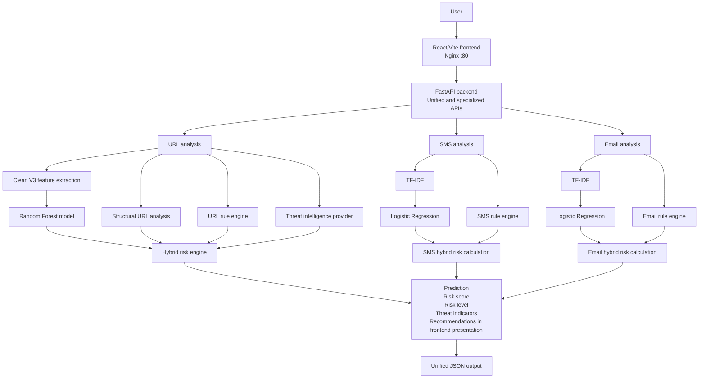

# PhishGuard AI

PhishGuard AI is a full-stack cybersecurity system for explainable URL, SMS, and email phishing analysis.

[](#testing)
[](#frontend)
[](#api)
[](#datasets)

## Overview

PhishGuard AI combines machine-learning classifiers, deterministic security rules, structural analysis, and a threat-intelligence provider interface into a single analysis platform. It accepts:

- URLs
- SMS messages
- Email subject and body content

The result is an explainable prediction and risk assessment with a score, risk level, and threat indicators. URL analysis uses a Clean V3 Random Forest model plus URL-specific structural and rule analysis. SMS and email analysis use TF-IDF and Logistic Regression models with channel-specific rule engines. A unified endpoint dispatches all three input types through the same analysis functions used by the specialized endpoints.

This is a production-oriented engineering project with a React/Vite frontend, FastAPI service, serialized ML artifacts, Docker deployment, automated tests, and AWS deployment support. It is a cybersecurity research and engineering system, not a replacement for enterprise security infrastructure.

## Live Deployment

The deployment design uses two separate containers on AWS:

```text
Browser -> React/Vite + Nginx frontend container :80
                       |
                       v
              FastAPI + ML backend :8000
```

- **Frontend:** React, Vite, and TypeScript compiled into static assets and served by Nginx.
- **Backend:** FastAPI and the production ML artifacts in a separate Docker image.
- **Infrastructure:** AWS EC2 hosts the containers; Amazon ECR stores the images.

No public frontend URL is verified in the repository. The current frontend deployment configuration points its API base URL to `http://18.207.241.111:8000`; the corresponding Swagger UI is available at `/docs` when that deployment is reachable. Public reachability and DNS are deployment concerns and are not asserted by this repository.

## Architecture



The specialized endpoints and `POST /api/analyze` reuse the same URL, SMS, and email analysis functions. The unified endpoint adds `input_type` to the selected specialized result.

The backend currently returns predictions, risk details, and indicators. It does not expose a separate `recommendations` field in its API contract. The frontend derives and displays recommendations from its presentation-layer analysis state.

## Core Features

### URL phishing detection

- Clean V3 structural and lexical feature extraction
- Random Forest phishing probability
- Observable URL metadata such as protocol, hostname, registrable domain, path depth, query count, and port
- Rule-based evidence combined with ML probability
- Offline threat-intelligence provider interface

### SMS and email detection

- SMS spam/phishing classification with TF-IDF and Logistic Regression
- Email phishing/spam classification using combined subject and body text
- Embedded URL inspection in message analysis
- Channel-specific rule engines for urgency, credential requests, financial language, links, threats, and sensitive actions
- Email checks for suspicious attachments and script-like HTML content

### Explainable security signals

The URL rule engine detects and reports signals including:

- HTTP usage
- IP-address URLs
- Suspicious top-level domains
- URL shorteners
- `@` symbols
- Percent-encoded characters
- Suspicious keywords
- Sensitive actions such as login, verification, password, payment, or account updates
- Brand impersonation and brand/domain mismatches
- Threat-intelligence indicators when a provider returns evidence

Additional capabilities include bounded threat-intelligence score adjustments, severity-based overrides, indicator deduplication, suspicious TLD detection, shortener detection, and a unified analysis API. Frontend result views can provide user-facing recommendations, but recommendations are not currently a backend response field.

## Machine Learning

The numbers below are validation results reproduced from the existing serialized artifacts, source datasets, and the split procedures implemented by the training scripts. They are dataset validation metrics, not guarantees of real-world detection performance.

### URL model

- Artifact: `ml/models/url_phishing_model_clean_v3.joblib`
- Model: scikit-learn `RandomForestClassifier`
- Features: 27 selected structural and lexical URL features
- Configuration: 500 trees, `class_weight="balanced"`, `max_features="sqrt"`
- Validation: grouped 80/20 split by domain with `GroupShuffleSplit(random_state=42)`
- Dataset rows: 235,795 raw URLs; 235,795 processed feature rows

| Metric | Grouped validation result |
| --- | ---: |
| Accuracy | 0.993233 |
| Precision | 0.992697 |
| Recall | 0.991635 |
| F1 | 0.992165 |
| ROC-AUC | 0.997610 |

### SMS model

- Source: UCI SMS Spam Collection represented by `ml/data/raw/sms/SMSSpamCollection`
- Dataset rows: 5,572 after the training script's basic cleaning
- Pipeline: TF-IDF word 1-2 grams followed by Logistic Regression
- Configuration: stratified 80/20 split, `random_state=42`, balanced classes, `max_iter=1000`, up to 50,000 features

| Metric | Stratified validation result |
| --- | ---: |
| Accuracy | 0.986547 |
| Precision | 0.965278 |
| Recall | 0.932886 |
| F1 | 0.948805 |

### Email model

- Source: CEAS 08 represented by `ml/data/raw/email/CEAS_08.csv`
- Raw rows: 39,154
- Rows after required-column cleaning, binary-label filtering, empty-content removal, and exact-text deduplication: 39,100
- Pipeline: combined subject/body text, TF-IDF word 1-2 grams, then Logistic Regression
- Configuration: stratified 80/20 split, `random_state=42`, balanced classes, `max_iter=1000`, up to 50,000 features

| Metric | Stratified validation result |
| --- | ---: |
| Accuracy | 0.995141 |
| Precision | 0.996324 |
| Recall | 0.994953 |
| F1 | 0.995638 |
| ROC-AUC | 0.999669 |

High validation scores reflect performance on these datasets and split procedures. They must not be interpreted as equivalent real-world phishing detection accuracy. Distribution shift, label quality, duplicate patterns, attacker adaptation, and unseen campaigns can materially change production performance.

## Risk Engine

PhishGuard's risk calculation follows this general pattern:

```text
ML prediction + deterministic rules + threat-intelligence evidence
    -> final risk score, risk level, and indicators
```

For URLs, the current hybrid score is:

```text
combined score = (ML probability * 100 * 0.30) + (rule score * 0.70)
```

Critical evidence floors the score at 80. High-severity evidence with sufficient rule score floors it at 70. Scores are clamped to 0-100. Risk levels are `LOW`, `MEDIUM`, `HIGH`, or `UNCERTAIN`.

The URL engine considers HTTP, IP addresses, suspicious TLDs, shorteners, `@`, encoded characters, suspicious keywords, sensitive actions, brand impersonation, ML probability, and threat-intelligence evidence. It also contains a safeguard for the known ML-only false-positive mode: high ML probability with zero rule evidence and no confirmed threat intelligence is capped at a low risk score.

SMS and email use their own hybrid calculations with 40% ML and 60% rule weighting, plus high-severity rule overrides.

Threat intelligence is currently deterministic and offline. The default local provider returns no match, while the provider interface allows future adapters and deterministic test doubles without changing the URL risk contract.

## API

The FastAPI application is defined in `backend/main.py`. Interactive OpenAPI documentation is served at `/docs` by FastAPI.

### `GET /health`

Returns service status and the configured model descriptions.

```http
GET /health
```

```json
{
  "status": "ok",
  "service": "PhishGuard AI",
  "ml_models": [
    "Clean V3 structural URL model",
    "TF-IDF + Logistic Regression SMS model",
    "TF-IDF + Logistic Regression Email model"
  ]
}
```

### `GET /`

Returns API metadata and the endpoint listing.

### `POST /api/analyze/url`

Analyzes one URL with ML prediction, URL structure, rules, threat-intelligence evidence, and hybrid risk scoring.

```json
{
  "url": "https://example.com/login"
}
```

The response contains `url`, `prediction`, `risk`, and `url_analysis`.

### `POST /api/analyze/sms`

Analyzes SMS text for spam/phishing language, links, embedded URLs, and risk evidence.

```json
{
  "text": "Your account has been suspended. Verify now."
}
```

The response contains `text`, `prediction`, and `risk`.

### `POST /api/analyze/email`

Analyzes an email subject and body for phishing/spam signals, embedded URLs, attachments, and script-like content.

```json
{
  "subject": "Urgent verification",
  "body": "Please verify your account immediately."
}
```

The response contains `subject`, `body`, `prediction`, and `risk`.

### `POST /api/analyze`

Dispatches to the same specialized analysis functions using `input_type`.

URL request:

```json
{
  "input_type": "url",
  "url": "https://example.com"
}
```

SMS request:

```json
{
  "input_type": "sms",
  "text": "Verify your account now."
}
```

Email request:

```json
{
  "input_type": "email",
  "subject": "Account verification",
  "body": "Please review your account."
}
```

The unified response adds `input_type` to the selected specialized response. URL inputs accept 3-4096 characters, SMS text accepts 1-10,000 characters, email subjects accept up to 1,000 characters, and email bodies accept up to 100,000 characters.

## Frontend

The frontend is a React application built with:

- React 18
- Vite 5
- TypeScript
- Tailwind CSS
- React Router
- Clerk React for authentication UI
- Vitest and Testing Library for frontend tests

The API helper reads the Vite build-time variable `VITE_API_BASE_URL` and falls back to `http://127.0.0.1:8000` for local development. `VITE_CLERK_PUBLISHABLE_KEY` is also supplied at build time. Only publishable Clerk configuration belongs in frontend assets; Clerk secret keys must never be exposed or committed.

For production, the frontend uses a multi-stage `frontend/Dockerfile`: Node builds the Vite bundle, and `nginx:alpine` serves it on port 80. `frontend/nginx.conf` uses `try_files` to support React `BrowserRouter` routes.

## Project Structure

```text
backend/
  main.py
  *_service.py
  *_risk.py
  *_risk_engine.py
  risk_engine.py
  threat_intelligence.py
  url_analysis.py
  tests/
frontend/
  src/
    components/
    hooks/
    lib/
    pages/
    test/
  public/
  Dockerfile
  nginx.conf
  package.json
  vite.config.ts
ml/
  models/
  data/
    raw/
    processed/
  src/
    features/
    training/
    evaluation/
    testing/
  notebooks/
docs/
  ARCHITECTURE.md
Dockerfile
.dockerignore
render.yaml
README.md
```

## Local Development

### Backend

From the repository root:

```powershell
python -m venv ml/.venv
.\ml\.venv\Scripts\Activate.ps1
python -m pip install -r backend/requirements.txt
python -m uvicorn backend.main:app --reload
```

The API runs at `http://127.0.0.1:8000`. Open Swagger at `http://127.0.0.1:8000/docs`.

### Frontend

```powershell
cd frontend
npm install
```

Create `frontend/.env.local` for local development:

```dotenv
VITE_API_BASE_URL=http://127.0.0.1:8000
VITE_CLERK_PUBLISHABLE_KEY=your_publishable_key
```

Then start Vite:

```powershell
npm run dev
```

The Vite development server uses the port configured by `frontend/vite.config.ts`.

## Testing

The complete validated Python test command is:

```powershell
python -m pytest backend/tests ml/src/testing -q
```

Latest validation result:

```text
83 passed, 2 warnings
```

The warnings are runtime deprecation warnings from the FastAPI/Starlette test stack. The standalone model test can also emit scikit-learn model-version warnings when artifacts trained under a different scikit-learn release are loaded. These warnings are not test failures.

Frontend validation:

```powershell
cd frontend
npm run build
npm run test
```

## Docker

### Backend image

The root `Dockerfile` builds the existing FastAPI image. It installs `backend/requirements.txt`, downloads the release model artifacts during the image build, copies the backend and runtime URL feature package, runs as `appuser`, and exposes port 8000.

```powershell
docker build -t phishguard-ai-backend:latest .
docker run -d --name phishguard-api --restart unless-stopped -p 8000:8000 phishguard-ai-backend:latest
```

Verify the backend health endpoint:

```powershell
curl http://127.0.0.1:8000/health
```

The backend image build requires access to the configured model release URLs. The existing backend image should not be rebuilt when only deploying the frontend.

### Frontend image

Build from the `frontend/` context because the root `.dockerignore` excludes `frontend/` when the repository root is used as context:

```powershell
cd frontend
docker build `
  --build-arg VITE_API_BASE_URL=http://18.207.241.111:8000 `
  --build-arg VITE_CLERK_PUBLISHABLE_KEY="$env:VITE_CLERK_PUBLISHABLE_KEY" `
  -t phishguard-frontend:latest `
  -f Dockerfile `
  .
```

Run Nginx on port 80:

```powershell
docker run -d --name phishguard-frontend --restart unless-stopped -p 80:80 phishguard-frontend:latest
```

The frontend container serves static assets only. It does not proxy API requests; the browser calls `VITE_API_BASE_URL` directly.

## AWS Deployment

```text
Local source
    -> Docker build
    -> Amazon ECR
    -> AWS EC2
    -> FastAPI backend container :8000
    -> React/Nginx frontend container :80
```

- **Amazon ECR:** private registry for versioned backend and frontend images.
- **EC2:** Docker host for the separate containers.
- **Docker:** reproducible runtime packaging for the API and static frontend.
- **IAM:** grants the EC2 instance or deployment identity only the ECR permissions it needs.
- **Security Groups:** expose only the required public ports; typically port 80 for the frontend and port 8000 only when direct backend access is intentionally required.
- **CORS:** set `PHISHGUARD_ALLOWED_ORIGINS` to the actual frontend origin. Do not use `*`; the backend enables credentials.

Example image workflow with placeholders:

```powershell
aws ecr get-login-password --region <region> | docker login --username AWS --password-stdin <account>.dkr.ecr.<region>.amazonaws.com
docker tag phishguard-frontend:latest <account>.dkr.ecr.<region>.amazonaws.com/phishguard-frontend:latest
docker push <account>.dkr.ecr.<region>.amazonaws.com/phishguard-frontend:latest
```

Never put AWS credentials, access keys, private keys, or Clerk secret keys in the repository, Dockerfile, frontend image, or README.

## Environment Variables

| Variable | Used by | Purpose |
| --- | --- | --- |
| `VITE_API_BASE_URL` | Frontend build | Backend base URL embedded by Vite at build time |
| `VITE_CLERK_PUBLISHABLE_KEY` | Frontend build | Clerk browser publishable key |
| `PHISHGUARD_ALLOWED_ORIGINS` | FastAPI runtime | Comma-separated allowed frontend origins for CORS |

Use `.env.local` or the deployment platform's secret/environment configuration for local and production values. Do not commit `.env.local`, credentials, API secrets, AWS credentials, or Clerk secret keys. Vite variables are shipped to the browser, so they must never contain private credentials.

## Datasets

The repository uses:

| Dataset | Repository path | Observed size | Usage |
| --- | --- | ---: | --- |
| PhiUSIIL Phishing URL Dataset | `ml/data/raw/PhiUSIIL_Phishing_URL_Dataset.csv` | 235,795 rows | URL feature generation and grouped model validation |
| UCI SMS Spam Collection | `ml/data/raw/sms/SMSSpamCollection` | 5,572 rows | SMS TF-IDF classifier |
| CEAS 08 | `ml/data/raw/email/CEAS_08.csv` | 39,154 raw rows; 39,100 after training cleanup/deduplication | Email TF-IDF classifier |

The repository identifies these sources but does not include verified license metadata for each dataset. Confirm the applicable dataset terms before redistribution or commercial use.

## Model Limitations

PhishGuard produces risk signals, not certainty. Important limitations include:

- Dataset bias and labeling assumptions
- Distribution shift between historical datasets and current campaigns
- False positives on unusual but legitimate content
- False negatives on novel or carefully crafted attacks
- Adversarial URLs designed to evade lexical and structural features
- Newly registered domains without useful reputation history
- Legitimate websites that have been compromised
- Stale or incomplete threat-intelligence evidence
- Domain, language, regional, and message-style coverage gaps

The validation metrics above describe the evaluated datasets and splits only. They do not establish 99%+ real-world phishing detection accuracy. This project is a cybersecurity research and engineering system and is not a replacement for enterprise security infrastructure, browser protections, email security gateways, or human review.

## Security Considerations

For a hardened public deployment, add or verify:

- HTTPS and secure transport termination
- Strong authentication and authorization
- Rate limiting and request-size controls
- Web Application Firewall protection
- Managed secret storage and rotation
- Structured logging and audit trails
- Metrics, monitoring, and alerting
- API abuse and automated scanning protection
- Network segmentation and least-privilege IAM
- Regular model, dependency, and threat-intelligence updates

## Development Roadmap

### Completed

- [x] Threat intelligence layer
- [x] Hybrid risk engine
- [x] Rich URL analysis
- [x] Email analysis
- [x] SMS analysis
- [x] Unified analysis API
- [x] Automated tests
- [x] Docker backend
- [x] Architecture documentation
- [x] AWS deployment

### Future improvements

- Integrate a maintained external threat-intelligence provider
- Add calibrated probabilities and versioned evaluation reports
- Add model and data drift monitoring
- Add HTTPS, WAF, rate limiting, and centralized secret management to deployment automation
- Add stronger API authentication and abuse controls
- Add a versioned backend recommendations field if product requirements require it
- Add CI checks for frontend images, security scanning, and end-to-end deployment smoke tests

## Author

**Muqeetuddin Mateen Mohammed**

- GitHub: [Mateenjr7](https://github.com/Mateenjr7)
- LinkedIn: [Mohammed Mateen Jr.](https://linkedin.com/in/mohammed-mateen-jr/)
