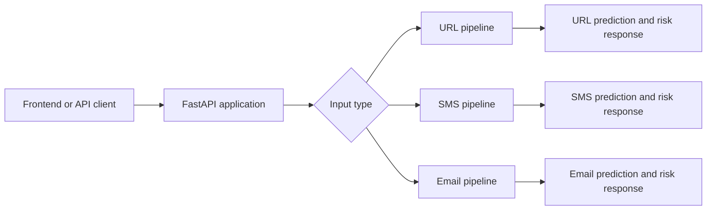
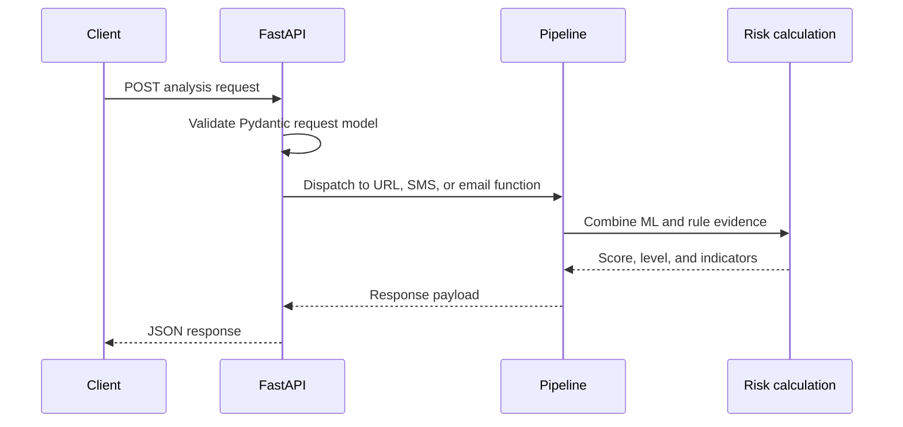
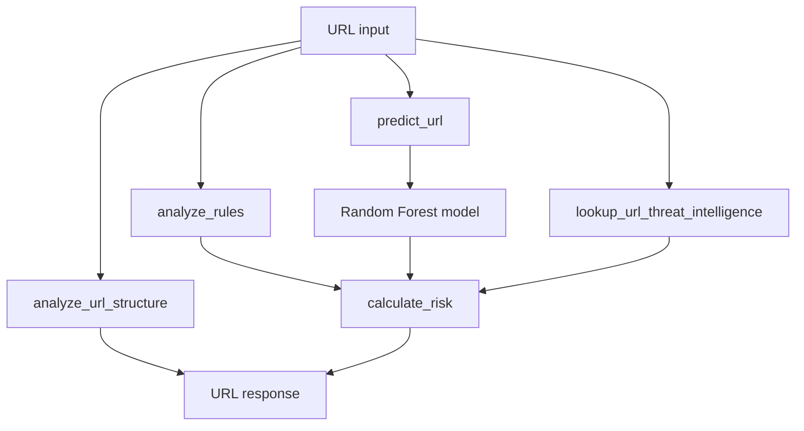
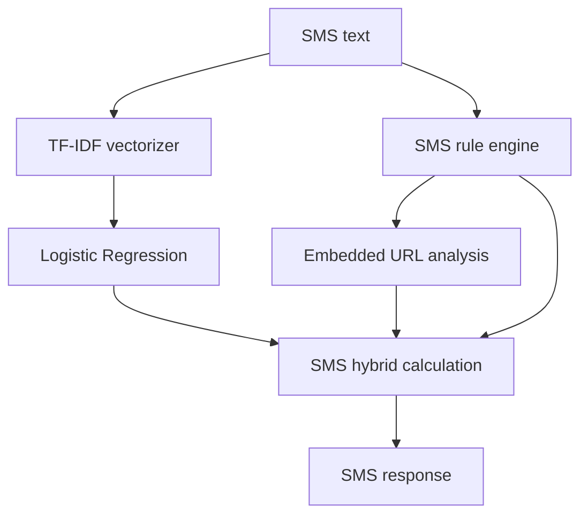
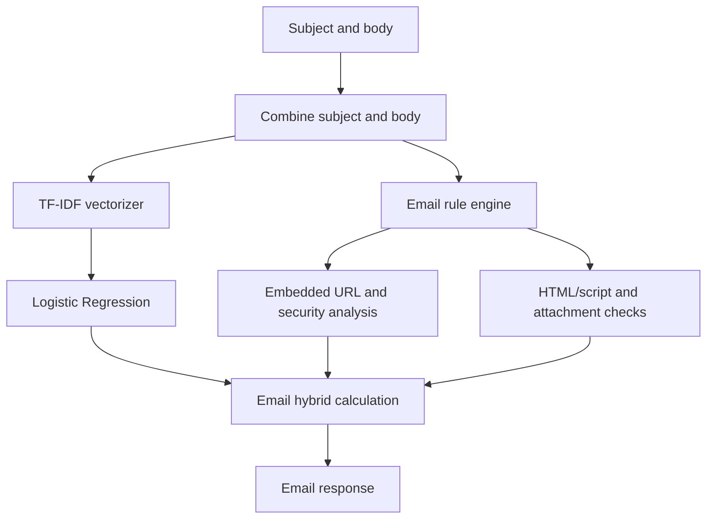

# PhishGuard AI Architecture

## System Overview

PhishGuard AI is a FastAPI service with three analysis pipelines: URL, SMS, and email. Each pipeline combines machine-learning inference with deterministic rule analysis and returns an explainable risk result. A Vite frontend consumes the backend through typed functions in `frontend/src/lib/api.ts`.



The application does not require a database, cache, external threat-intelligence credential, or network call during analysis.

## Component Responsibilities

| Component | Responsibility |
| --- | --- |
| `backend/main.py` | FastAPI app, request validation, endpoint dispatch, response shaping, CORS, health and root metadata |
| `backend/ml_service.py` | URL model loading, URL feature selection, and Random Forest inference |
| `backend/sms_service.py` | SMS model/vectorizer loading and inference |
| `backend/email_service.py` | Email model/vectorizer loading and inference |
| `backend/risk_engine.py` | URL normalization, URL rules, brand handling, risk combination, threat-intelligence adjustment |
| `backend/sms_risk_engine.py` | SMS language, link, phone, money, and embedded URL rule analysis |
| `backend/email_risk_engine.py` | Email language, link, attachment, HTML/script, and embedded URL rule analysis |
| `backend/sms_risk.py` | SMS ML/rule score combination and response calculation |
| `backend/email_risk.py` | Email ML/rule score combination and response calculation |
| `backend/url_analysis.py` | Observable URL metadata extraction without assigning a verdict |
| `backend/threat_intelligence.py` | Threat-intelligence provider interface and offline local provider |
| `ml/src/features/feature_extractor_clean.py` | Runtime URL feature extraction for the deployed URL model |
| `ml/models/` | Serialized URL model, SMS model/vectorizer, and email model/vectorizer |

## Request Flow



The unified endpoint delegates to the same functions used by the specialized endpoints. It adds `input_type` to the returned object without changing the specialized response fields.

## URL Pipeline



`predict_url` loads `ml/models/url_phishing_model_clean_v3.joblib` and extracts the configured 27 features using `ml.src.features.feature_extractor_clean`. The rule engine checks protocol, IP addresses, suspicious TLDs, shorteners, `@`, percent encoding, suspicious terms, sensitive actions, and brand/domain relationships.

`analyze_url_structure` returns protocol, hostname, registrable domain, TLD, subdomain count, IP detection, URL and domain lengths, path and path depth, query information, fragment, port, percent encoding, `@` detection, shortener detection, and suspicious-TLD detection.

## SMS Pipeline



The SMS model uses `sms_tfidf_vectorizer.joblib` and `sms_phishing_model.joblib`. The rule engine identifies urgency, account and verification language, credentials, financial terms, rewards, threats, links, link actions, phone numbers, money terms, and combinations such as account plus verification or threat plus verification. Embedded URLs reuse the shared URL rule engine for selected URL indicators.

## Email Pipeline



The email model uses `email_tfidf_vectorizer.joblib` and `email_phishing_model.joblib`. The email rule engine identifies urgency, account, verification, credentials, financial, reward, threat, suspicious URL, executable attachment, and script-like HTML evidence. It also detects combinations such as credentials plus a link and financial language plus urgency.

## Risk Scoring Architecture

### URL

The URL risk engine computes:

```text
combined score = (ML probability * 100 * 0.30) + (rule score * 0.70)
```

Critical rule evidence floors the score at 80. High rule evidence with a rule score of at least 50 floors it at 70. Scores are clamped to 0-100 and rounded to two decimals.

Risk levels are `LOW`, `MEDIUM`, `HIGH`, or `UNCERTAIN`. `UNCERTAIN` applies when ML probability is 0.40-0.60 inclusive and rule score is 20-60 inclusive. Otherwise, scores below 40 are `LOW`, scores from 40 through 69 are `MEDIUM`, and scores of 70 or more are `HIGH`.

To reduce a known false-positive mode, a high ML probability of at least 0.90 with zero rule evidence and no confirmed threat intelligence is forced to `LOW` and capped at 25.

### SMS and Email

`backend/sms_risk.py` and `backend/email_risk.py` use a 40% ML and 60% rule weighting. Their rule scores and high-severity indicators drive the final risk level. Their response risks contain score, level, ML probability, rule score, and indicators.

### Threat intelligence

Matched threat-intelligence evidence contributes severity adjustments of 5 for `info`/`low`, 10 for `medium`, 20 for `high`, and 30 for `critical`, capped at 30 total. Matched high evidence forces at least `HIGH` and 70; matched critical evidence forces at least `HIGH` and 80. Duplicate indicators are deduplicated by type, severity, and message.

### Brand handling

Known brands on recognized official registrable domains produce informational indicators without adding rule points. The same brand on an unrelated domain contributes impersonation evidence. Brand impersonation combined with sensitive actions is critical evidence.

## Threat Intelligence Integration

`ThreatIntelligenceProvider` is an abstract interface with `lookup_url`. `LocalThreatIntelligenceProvider` is the current default and returns `matched=False` with no indicators. `lookup_url_threat_intelligence` supports provider injection for deterministic tests and future adapters.

No external service is called by the current implementation. There are no API keys or threat-intelligence secrets required for local execution or Docker startup.

## ML Model Layer

| Input | Runtime artifacts | Model | Training procedure |
| --- | --- | --- | --- |
| URL | `url_phishing_model_clean_v3.joblib` | Random Forest, 500 estimators, balanced classes | Grouped 80/20 domain split, `random_state=42`, 27 selected features |
| SMS | `sms_phishing_model.joblib`, `sms_tfidf_vectorizer.joblib` | TF-IDF 1-2 grams plus Logistic Regression | Stratified 80/20 split, `random_state=42`, balanced classes |
| Email | `email_phishing_model.joblib`, `email_tfidf_vectorizer.joblib` | TF-IDF 1-2 grams plus Logistic Regression | Stratified 80/20 split, `random_state=42`, balanced classes |

Training scripts compute evaluation metrics, but metric output is not stored as a versioned report in the repository. Architecture documentation therefore does not assert numeric model performance.

## API Layer

`backend/main.py` exposes:

- `GET /health`: service status and configured model descriptions
- `GET /`: API metadata and endpoint listing
- `POST /api/analyze/url`: URL-specific analysis
- `POST /api/analyze/sms`: SMS-specific analysis
- `POST /api/analyze/email`: email-specific analysis
- `POST /api/analyze`: unified dispatch using `input_type` values `url`, `sms`, and `email`

Pydantic models enforce URL length 3-4096, SMS length 1-10,000, email subject length up to 1,000, and email body length up to 100,000. Specialized handlers also reject blank SMS and empty email content. Unified missing URL/text and empty email content return 400; invalid or missing `input_type` is validated as 422.

## Docker Deployment Architecture

```mermaid
flowchart LR
    Host[Docker host :8000] --> Container[python:3.11-slim container]
    Container --> Uvicorn[Uvicorn 0.0.0.0:8000]
    Uvicorn --> App[backend.main:app]
    App --> Artifacts[/app/ml/models and /app/ml/src/features]
    Container --> Health[GET /health health check]
```

`Dockerfile` installs only `backend/requirements.txt`, copies backend runtime code, the URL feature package, and the five model artifacts required by inference. `.dockerignore` excludes datasets, training/evaluation code, frontend dependencies, tests, caches, secrets, and VCS files. The container runs as non-root user `appuser` and uses `PORT` when provided, defaulting to 8000.

Commands:

```powershell
docker build -t phish-guard-ai-backend .
docker run --rm -p 8000:8000 phish-guard-ai-backend
```

The health check calls `http://127.0.0.1:8000/health` from inside the container. No compose service is needed because the backend has no database, cache, or external runtime dependency.

## Production Configuration

`PHISHGUARD_ALLOWED_ORIGINS` is an optional comma-separated environment variable for deployed frontend origins. The four localhost development origins remain enabled by default. Wildcard origins are rejected because the API enables credentials. Render uses the repository's `render.yaml`, the root Dockerfile, the `standard` service plan, and `/health` as its service health check. The frontend remains a separate deployment and should use the Render backend URL as its API base URL.

## Testing Architecture

Backend tests live under `backend/tests/` and cover:

- URL structure and malformed URL behavior
- URL, SMS, and email rule engines
- risk scoring, overrides, threat-intelligence adjustment, deduplication, and immutability
- API contract and unified endpoint dispatch through FastAPI `TestClient`
- validation and regression behavior

The backend suite is run with:

```powershell
.\ml\.venv\Scripts\python.exe -m pytest backend/tests -q
```

The frontend uses Vitest:

```powershell
cd frontend
npm test -- --run
```

The frontend production build is checked with:

```powershell
cd frontend
npm run build
```

Tests do not require external network services or threat-intelligence credentials.

## Data and Model Flow

Training datasets remain under `ml/data/` and are consumed by scripts under `ml/src/training/`. Training produces serialized artifacts under `ml/models/`. Runtime backend modules load only those artifacts and the URL feature extractor. The Docker image does not copy raw datasets or training scripts.

Current dataset sources are the PhiUSIIL URL dataset from UCI, `SMSSpamCollection`, and `CEAS_08.csv`. Dataset boundaries and labeling choices affect model generalization.

## Important Design Decisions

1. The repository root is the Python import root so `backend.*` and `ml.*` package imports work consistently locally and in Docker.
2. URL structural metadata is kept separate from risk verdict calculation.
3. Learned predictions are combined with explainable rules instead of replacing them.
4. Threat intelligence is modeled behind an interface so offline deterministic behavior is available today and adapters can be added later.
5. The URL ML contribution is intentionally limited and has an ML-only false-positive safeguard.
6. Docker copies explicit runtime artifacts instead of copying the full repository into the image.

## Current Limitations

- The default threat-intelligence provider is offline and returns no match.
- The datasets may not represent current attacker behavior, languages, or domains.
- Training-script metrics are not stored as a verified report.
- Real-world performance can differ from held-out evaluation.
- False positives, false negatives, and model/data drift are possible.
- The API returns indicators and risk metadata, but no separate recommendations field.
- The service provides risk signals and does not guarantee phishing detection.

## Future Extension Points

- Add an external threat-intelligence provider behind `ThreatIntelligenceProvider`.
- Version and publish reproducible model evaluation reports.
- Add calibrated probabilities and monitoring for data/model drift.
- Add authenticated deployment and operational observability.
- Add a formal recommendation field to the API contract if product requirements call for remediation guidance.
